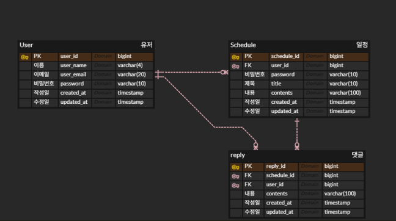

# ScheduleDevelopProject

🪄 - **일정 관리 앱 프로젝트**

## 🖥️ 개발 프로세스(환경)

### ⛏️IDE :
- `Intellij`

### 📌 Java :
- **JDK 17버전 사용**

### 🔁 Version Control :
- `GitHub`

### 🎗️ API 테스트 도구
- `PostMan`

<br>
<hr>

## 📜 시스템 설계 문서

- **[회원가입 API](https://documenter.getpostman.com/view/44617139/2sB2qajMxB)**


- **[로그인 API](https://documenter.getpostman.com/view/44617139/2sB2qajMxE)**


- **[유저 API](https://documenter.getpostman.com/view/44617139/2sB2qXk3Jy)**


- **[일정 API](https://documenter.getpostman.com/view/44617139/2sB2qXk3Jx)**


- **[댓글 API](https://documenter.getpostman.com/view/44617139/2sB2qcD1JG)**


- **[페이지 API](https://documenter.getpostman.com/view/44617139/2sB2qcD1NX)**


- **ERD**




<hr>

## ✅ 요구사항

<hr>

### 💝 공통 목표    

- **모든 테이블 고유 식별자(ID)를 가짐**


- **3Layer Architecture 목적에 맞게 사용**


- **CRUD 필수 기능은 데이터베이스 연결, `JPA`를 사용해서 개발**


- **인증/인가 절차는 `Cookie/Session`을 활용**


- **JPA 연관 관계는 `단방향`, 정말 필요한 경우는 `양방향` 사용**

<hr>

### [LV0️⃣] API 명세 및 ERD 작성

- **API 명세서 작성**


- **ERD 작성 작성**


- **SQL query 작성**

  - **설치한 데이터베이스(MySQL)에 ERD를 따라 테이블 생성**

  - **root(최상위) 경로에 `schedule.sql`파일을 만들고 테이블에 생성에 필요한 query 작성**


<hr>

### [LV1️⃣] 일정 CRUD

- **일정 (생성, 조회, 수정, 삭제) 가능**


- **일정 필드 : `작성 유저명`, `할일 제목`, `할일 내용`, `작성일`, `수정일`**

  - **`작성일`, `수정일` 필드는 `JPA Auditing` 활용 **

<hr>

### [LV2️⃣] 유저 CRUD

- **유저 (생성, 조회, 수정, 삭제) 가능**


- **유저 필드 : `유저명`, `이메일`, `작성일`, `수정일`**

  - **`작성일`, `수정일` 필드는 `JPA Auditiin` 활용**

  - **연관관계 : `유저명` 필드 대신 `유저 고유 식별자` 필드로 변경**

<hr>

### [LV3️⃣] 회원가입

- **유저에 `비밀번호` 필드 추가**

  - **아이디 : `이메일`, 비밀번호 사용해서 회원가입 구현**

    - **아이디 중복 확인**  

<hr>

### [LV4️⃣] 로그인(인증)

- **`이메일`, `비밀번호`을 활용해 로그인 기능 구현**

- **인터페이스 : `HttpServletRequest` 활용**

- **Cookie/Session 활용하여 로그인 기능 구현**

- **Filter 활용하여 인증 처리**

  - **Filter 인터페이스 상속하여 사용**

    - **doFilter() 오버라이딩 하여 사용**

    - **회원가입, 로그인 요청은 인증 처리에서 제외**

- **`@Comfiguration` 활용하여 필터 등록**


- **예외처리 : 로그인 시 이메일과 비밀번호가 일치 하지 않을 경우 `HTTP CODE 401` 반환**

<hr>

### [LV5️⃣] 다양한 예외처리 적용

- **`Validation`을 활용해 다양한 예외처리 적용**

  - **ex) 할일 제목 10글자 이내, 유저명 4명 글자 이내, 이메일 `@pattern` 사용 등**

<hr>

### [LV6️⃣] 비밀번호 암호화

- **비밀번호 암호화**

  - **`PasswordEncoder` 사용**

> `build.gradle` 의존성 추가 
```build.gradle
implementation 'at.favre.lib:bcrypt:0.10.2'
```

<br>

> config 패키지에 `PasswordEncoder` 클래스 추가
```java
import at.favre.lib.crypto.bcrypt.BCrypt;
import org.springframework.stereotype.Component;

@Component
public class PasswordEncoder {

    public String encode(String rawPassword) {
        return BCrypt.withDefaults().hashToString(BCrypt.MIN_COST, rawPassword.toCharArray());
    }

    public boolean matches(String rawPassword, String encodedPassword) {
        BCrypt.Result result = BCrypt.verifyer().verify(rawPassword.toCharArray(), encodedPassword);
        return result.verified;
    }
}
```


<hr>

### [LV7️⃣] 댓글 CRUD

- **생성한 일정에 댓글을 남김**

  - **댓글과 일정은 연관관계를 가짐**

  - **댓글과 유저도 연관관계를 가짐**


- **댓글 (저장, 조회, 수정, 삭제) 가능**


- **댓글 필드 : `댓글 내용`, `작성일`, `수정일`, `유저 고유 식별자`, `일정 고유 식별자`**

  - **`작성일`, `수정일` 필드는 JPA Auditing 활용**

- **ERD, schedule.sql에 댓글 추가**
<hr>

### [LV8️⃣] 일정 페이징 조회

- **데이터베이스**

  - **`offset` / `limit` : SELECT 쿼리에 적용해서 데이터를 제한 범위에 맞게 조회 가능**


- **페이징**

  - **`Pageable` : `Spring Data JPA`에서 제공되는 페이징 관련 `인터페이스`**
  
  - **`PageRequest` : `Spring Data JPA`에서 제공되는 페이지 요청 관련 `클래스`**

  - **`Page<T>`는 Spring Data JPA에서 제공하는 페이징 결과를 담는 `인터페이스`**


- **일정을 Spring Data JPA의 `Pageable`과 `Page` 인터페이스를 활용하여 페이지네이션 구현**


- **페이징 필드 : `할일 제목`, `할일 내용`, `댓글 개수`, `일정 작성일`, `일정 수정일`, `일정 작성 유저명` 조회**


- **페이지 크기 : default = 10**


- **일정의 `수정일` 기준으로 내림차순 정렬**

<hr>

## 🎲 주요 기능 

- **JPA를 활용한 데이터베이스 관리 -> CRUD에 대한 구조 이해**

    - **연관관계 설정**

    - **JPA의 주요 개념을 실제 어플리케이션에 적용 구현**


- **Cookie/Session을 활용한 인증/인가 -> 보안 개념과 인증 메커니즘 이해**

    - **어플리케이션 보안과 접근 제어**

    - **Validation**

    - **Servlet Filter, Cookie/Session**

<hr>

## 🗂️ 디렉토리 구조

```
project/
├── src/
│   ├── main/
│   │   ├── java/
│   │   │   └── com/project/scheduledelevopproject/
│   │   │       ├── config/          # 설정 관련 클래스
│   │   │       ├── controller/      # API 요청 처리
│   │   │       ├── dto/             # 요청/응답 DTO
│   │   │       ├── entity/          # JPA 엔티티 클래스
│   │   │       ├── filter/          # 인증, 보안 필터
│   │   │       ├── repository/      # DB 접근 레이어
│   │   │       └── service/         # 비즈니스 로직
│   ├── resources/
│   │   ├── application.yml          # 환경 설정 파일
│   │   └── templates/               # 뷰 템플릿 (필요 시)
├── schedule.sql                    # DB 초기 스크립트
├── build.gradle                   # Gradle 빌드 설정
└── README.md                      # 프로젝트 설명 및 문서
```

<hr>

## 💫 트러블 슈팅

- **[Velog](https://velog.io/@dkzh506/Springboot-%EC%9D%BC%EC%A0%95-%EA%B4%80%EB%A6%AC-%EC%95%B1-Develop)에서 확인**


